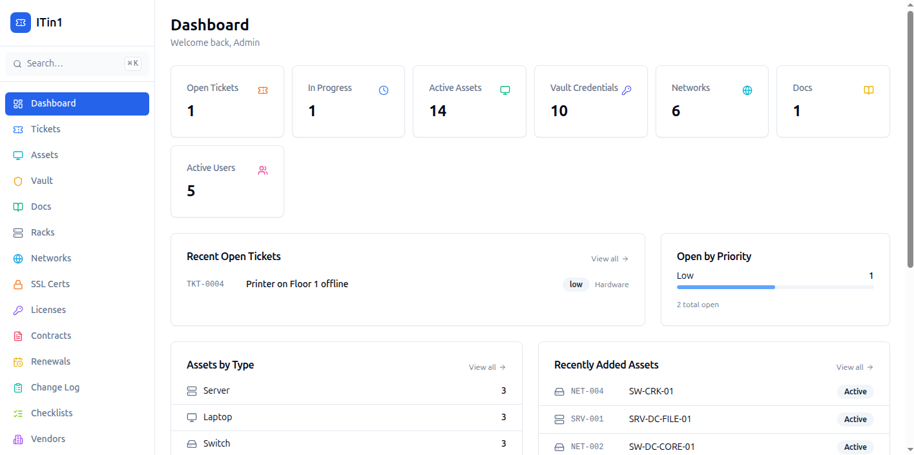
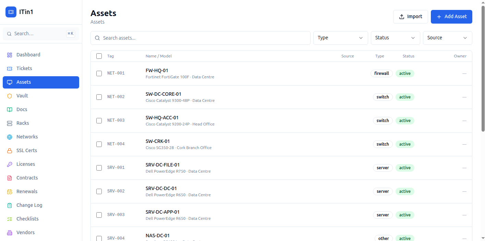
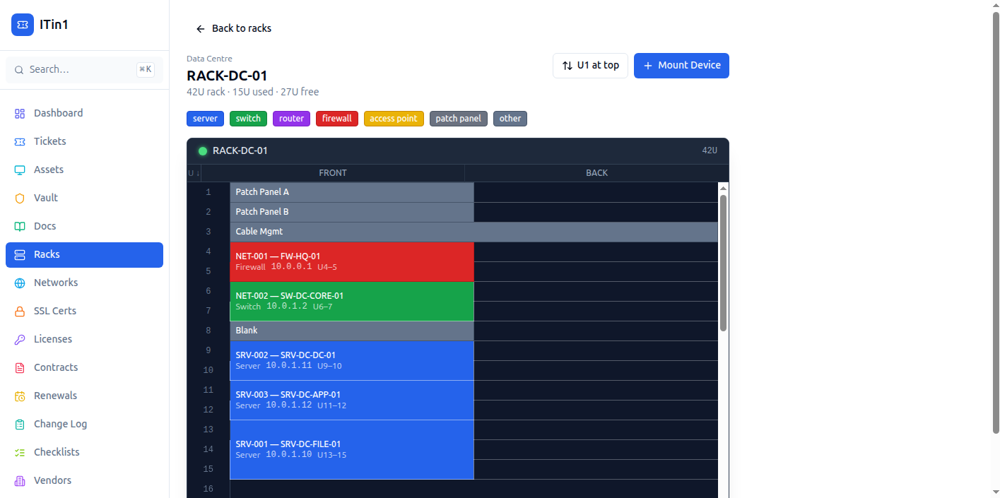
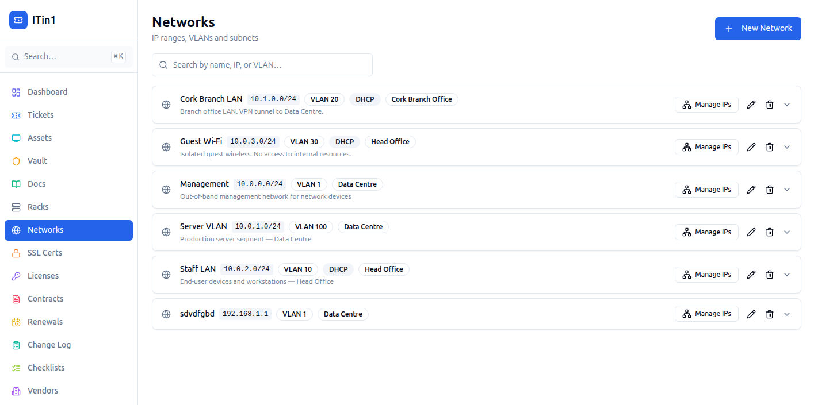
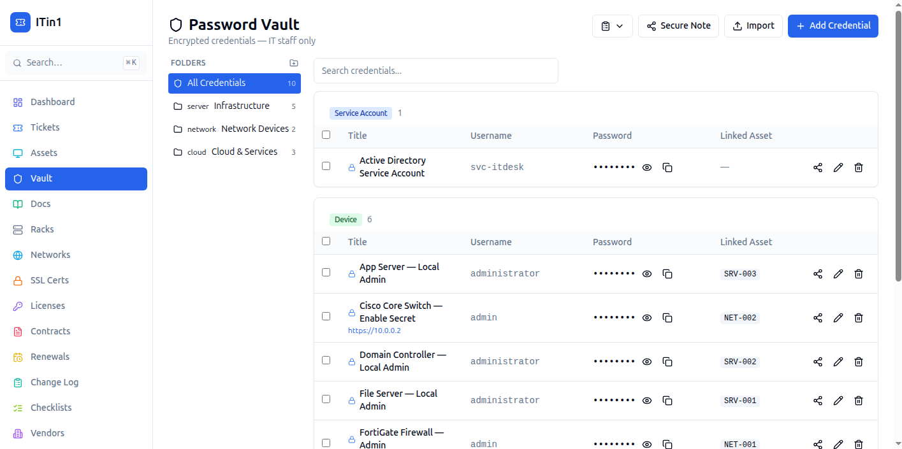
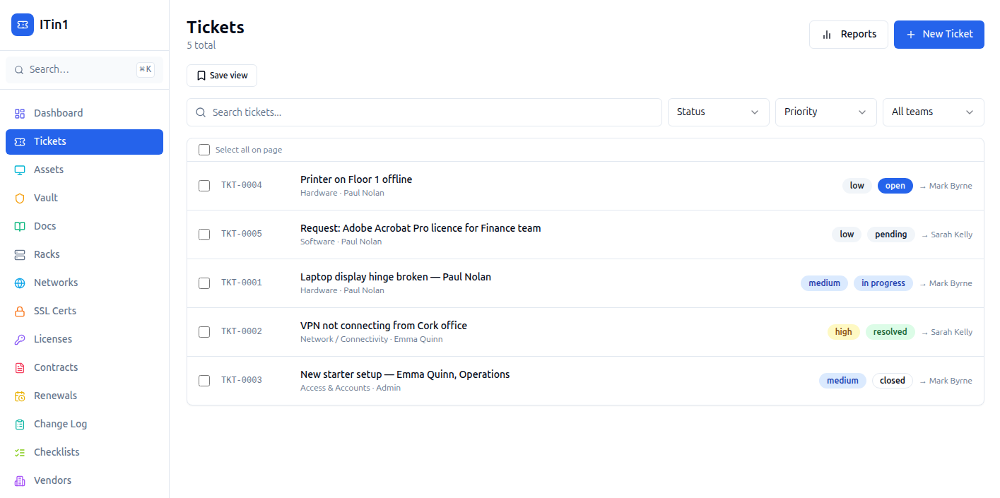
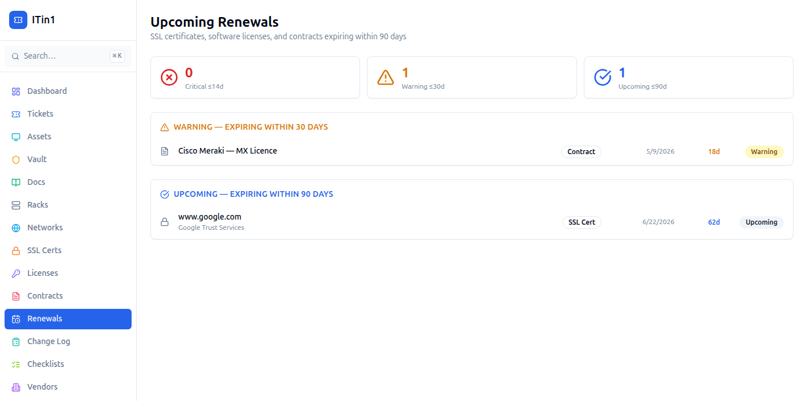

# ITin1

A self-hosted IT management platform for small and mid-sized organisations. Built for IT teams who want a single place to manage assets, credentials, documentation, and operations — without sending data to a third party.

> **Status:** Active development. Production-ready for internal use. Public release in progress.

---

## Screenshots


*Dashboard — asset counts, ticket summary, and upcoming renewals at a glance*

---


*Asset Management — full lifecycle tracking across all device types*

---


*Rack Diagram — visual U-slot layout with front/back mounting*

---


*Network & IPAM — subnet tracking with IP allocation*

---


*Password Vault — AES-256-GCM encrypted credentials with folder organisation and audit log*

---


*Ticketing — status/priority workflow with comments and asset linking*

---


*Renewals Dashboard — unified view of SSL, licence, and contract expiries*

---

## Features

### Ticketing
- End-user ticket submission with priority and category
- Technician assignment and status tracking
- File attachments

### Asset Management
- Full asset lifecycle tracking (laptops, servers, networking gear, etc.)
- Asset tagging, location, and assignment to users
- Intune integration — sync managed devices automatically
- Meraki integration — sync network devices
- CSV import

### Password Vault
- AES-256-GCM encrypted credential storage
- Folder organisation
- Access levels: all staff, admins only, or named users
- Full audit log (who viewed or copied what, and when)
- Secure share — generate a one-time link to share a credential externally
- CSV import

### Network
- Rack management with U-slot visualisation
- Network/subnet tracking with IPAM
- IP address allocation and TCP port scanning

### Documentation
- Rich-text knowledge base with categories and tags
- Source URL tracking for external reference documents
- Full-text search

### SSL Certificate Tracking
- Manual or auto-imported certificate monitoring
- Expiry alerts via email digest

### Software Licences
- Track licence keys, seat counts, billing cycles, renewal dates
- Expiry alert emails (critical / warning / notice thresholds)

### Contracts & Warranties
- Contract tracking with notice period deadlines
- Document URL attachment
- Renewal alert emails

### Renewals Dashboard
- Unified view of all upcoming SSL, licence, and contract renewals
- Sorted by days remaining with critical/warning/upcoming grouping

### IT Change Log
- Infrastructure diary for tracking changes, incidents, and rollbacks
- Category tagging and full-text search
- Pagination

### Onboarding / Offboarding Checklists
- Template builder with required and optional items
- Run checklists for named employees with progress tracking
- Auto-complete when all required items are done

### Contacts & Vendors
- Vendor and contact directory linked to assets, credentials, and contracts

### Admin
- Local user management with role-based access (end user / technician / admin / super admin)
- Active Directory / LDAP authentication
- Organisation branding (name, logo)
- MongoDB backup and restore
- Email (SMTP) configuration

---

## Tech Stack

- **API:** Node.js, Express, TypeScript, MongoDB, Redis, BullMQ
- **Web:** React, TypeScript, Tailwind CSS, shadcn/ui, TanStack Query
- **Auth:** JWT (RS256), optional LDAP/AD
- **Infrastructure:** Docker Compose, Nginx

---

## Requirements

- Ubuntu 22.04 LTS or 24.04 LTS (other Linux distros should work)
- Docker and Docker Compose plugin
- 2 vCPU, 4 GB RAM minimum (8 GB recommended)
- 20 GB disk

---

## Quick Install

```bash
curl -fsSL https://raw.githubusercontent.com/chrisnicholldev/ITin1/main/install.sh | bash
```

_Installs Docker if needed, generates secrets, and starts the stack. See [docs/deployment.md](docs/deployment.md) for manual installation._

---

## Manual Installation

See **[docs/deployment.md](docs/deployment.md)** for step-by-step instructions including:
- Docker installation
- Secret generation (JWT key pair, vault encryption key)
- `.env` configuration reference
- HTTPS setup
- Backup and restore

---

## Configuration

Copy `infra/.env.example` to `infra/.env` and fill in the required values:

| Variable | Required | Description |
|---|---|---|
| `MONGO_ROOT_PASSWORD` | Yes | MongoDB root password |
| `MONGO_APP_PASSWORD` | Yes | MongoDB app user password |
| `JWT_PRIVATE_KEY` | Yes | RS256 private key (newlines as `\n`) |
| `JWT_PUBLIC_KEY` | Yes | RS256 public key (newlines as `\n`) |
| `VAULT_ENCRYPTION_KEY` | Yes | 64-char hex string (`openssl rand -hex 32`) |
| `LDAP_ENABLED` | No | Set `true` to enable Active Directory auth |
| `SMTP_ENABLED` | No | Set `true` to enable email alerts |
| `INTUNE_ENABLED` | No | Set `true` to enable Intune device sync |
| `MERAKI_ENABLED` | No | Set `true` to enable Meraki sync |

---

## Default Login

On first run, a super admin account is created:

- **Username:** `admin`
- **Password:** `changeme123!`

**Change this immediately after first login.**

---

## Updating

```bash
cd /opt/itdesk
git pull
cd infra
docker compose build --no-cache
docker compose up -d
```

Or use the included `update.sh` script from the repo root:

```bash
bash update.sh
```

---

## Integrations

### Active Directory / LDAP
Configure group mappings for automatic role assignment on login. See `infra/.env.example` for all LDAP variables.

### Microsoft Intune
Requires an Azure App Registration with Device.Read.All permission. See [docs/intune-setup.md](docs/intune-setup.md).

### Cisco Meraki
Requires a Meraki API key and Organisation ID.

---

## Contributing

See [CONTRIBUTING.md](CONTRIBUTING.md).

---

## Security

To report a vulnerability, see [SECURITY.md](SECURITY.md). Do not open a public issue.

---

## Licence

ITin1 is open source under [AGPL-3.0](LICENSE) — free to self-host and modify, provided modifications are kept open source.

If you need to use ITin1 without AGPL obligations (proprietary or commercial use), a commercial license is available. See [COMMERCIAL_LICENSE.md](COMMERCIAL_LICENSE.md) or contact **dev@chrisnicholl.com**.

Copyright (C) 2025 Chris Nicholl
